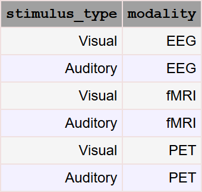

.. progress: 12.0 0% Dimitri

.. _keysource:

Key Source
==========

Default key source
------------------

**Key source** refers to the set of primary keys over which :ref:`autopopulate <auto>` iterates.
By default, the key source for a table is the :ref:`join <join>` of its primary :ref:`dependencies <dependencies>`.

For example, consider a schema with three tables.
The ``Stimulus`` table contains one attribute ``stimulus_type`` with one of two values, "Visual" or "Auditory".
The ``Modality`` table contains one attribute ``modality`` with one of three values, "EEG", "fMRI", and "PET".
The ``Protocol`` table has primary dependencies on both the ``Stimulus`` and ``Modality`` tables.

The key source for ``Protocol`` will then be all six combinations of ``stimulus_type`` and ``modality`` as shown in the figure below.

Custom key source
-----------------

.. include:: 02-keysource_lang1.rst

.. note::
  Customization of the source of keys for the ``make`` calls in :ref:`autopopulation <auto>`.
