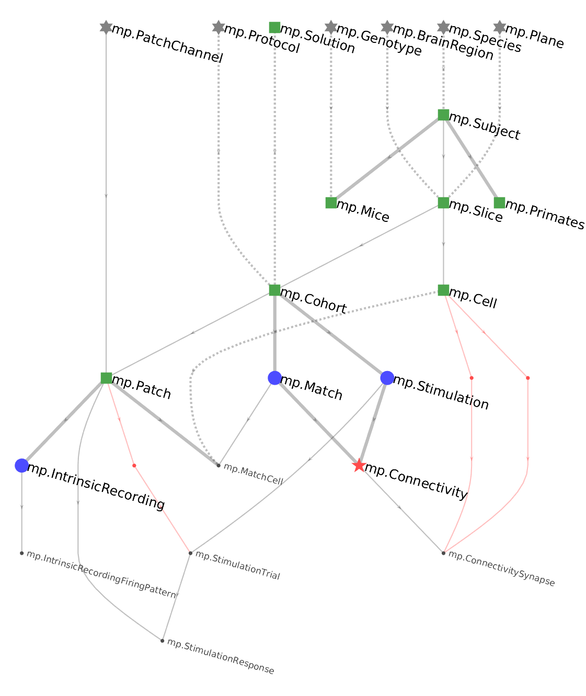

.. progress: 24.0 10% Dimitri

ERD
===

ERD stands for **entity relationship diagram**.  Objects of type ``dj.ERD`` allow visualizing portions of the data pipeline in graphical form.
Tables are depicted as nodes and :doc:`../definition/10-Foreign-Keys` as directed edges between them.
The `draw` method plots the graph.

Diagram notation
----------------
Consider the following ERD

DataJoint uses the following conventions:

* Tables are indicated as nodes in the graph.  The corresponding class name is indicated by each node.
* :doc:`../definition/05-Data-Tiers`  are indicated as colors and symbols: Lookup=gray asterisk, Manual=green square, Imported=blue circle,  Computed=red star, Part=black dot.  The names of :doc:`../computation/04-master-part` are indicated in a smaller font.
* :doc:`../definition/10-Foreign-Keys` are indicated as edges in the graph and always directed downward, forming a **directed acyclic graph**.
* Foreign keys contained within the primary key are indicated as solid lines.  This means that the referenced table becomes part of the primary key of the dependent table.
* Foreign keys that are outside the primary key are indicated by dashed lines.
* If the primary key of the dependent table has no other attributes besides the foreign key, the foreign key is a thick solid line, indicating a 1:{0,1} relationship.
* Foreign keys made without renaming the foreign key attributes are in black whereas foreign keys that rename the attributes are indicated in red.  This includes renamed foreign keys within the primary key (solid line) or outside (dashed line).

Diagramming an entire schema
----------------------------

.. python 1 start
|python| Python
+++++++++++++++

To plot the ERD for an entire schema in Python, an ERD object can be initialized with the schema object (which is normally used to decorate table objects)

.. code-block:: python

    import datajoint as dj
    schema = dj.schema('my_database')
    dj.ERD(schema).draw()

or, alternatively an object that has the schema object as an attribute, such as the module defining a schema:

.. code-block:: python

    import datajoint as dj
    import seq    # import the sequence module defining the seq database
    dj.ERD(seq).draw()   # draw the ERD

.. python 1 end

.. matlab 1 start
|matlab| MATLAB
+++++++++++++++

In MATLAB, the schema object for a package can be obtained using its ``getSchema`` function (See :doc:`../definition/01-Creating-Schemas`).

.. code-block:: matlab

    draw(dj.ERD(seq.getSchema))   % draw the ERD

MATLAB provides shortcuts to plot ERD of a table neighborhood or a schema using the ``erd`` command:

.. code-block:: matlab

    % plot the ERD of the stimulus schema
    erd stimulus

    % plot the neighborhood of the stimulus.Trial table
    erd stimulus.Trial

    % plot the stimulus and experiment schemas and the neighborhood of preprocess.Sync
    erd stimulus experiment preprocess.Sync
.. matlab 1 end

Initializing with a single table
++++++++++++++++++++++++++++++++

A `dj.ERD` object can be initialized with a single table.

.. matlab 2 start
|matlab|

.. code-block:: matlab

    draw(dj.ERD(seq.Genome))
.. matlab 2 end

.. python 2 start
|python|

.. code-block:: python

    dj.ERD(seq.Genome).draw()
.. python 2 end

A single node makes a rather boring graph but ERDs can be added together or subtracted from each other using graph algebra.

Adding ERDs together
++++++++++++++++++++

However two graphs can be added, resulting in new graph containing the union of the sets of nodes from the two original graphs. The corresponding foreign keys will be automatically

.. matlab 3 start
|matlab|

.. code-block:: matlab

    % matlab: plot the ERD with tables Genome and Species from package +seq.
    draw(dj.ERD(seq.Genome) + dj.ERD(seq.Species))
.. matlab 3 end

.. python 3 start
|python|

.. code-block:: python

    # Python: plot the ERD with tables Genome and Species from module seq.
    (dj.ERD(seq.Genome) + dj.ERD(seq.Species)).draw()
.. python 3 end

Expanding ERDs upstream and downstream
++++++++++++++++++++++++++++++++++++++

Adding a number to an ERD object adds nodes downstream in the pipeline while subtracting a number from ERD object adds nodes upstream in the pipeline.

Examples:

.. matlab 4 start
|matlab| MATLAB

.. code-block:: matlab

    % Plot all the tables directly downstream from ``seq.Genome``:
    draw(dj.ERD(seq.Genome)+1)

.. code-block:: matlab

    % Plot all the tables directly upstream from ``seq.Genome``:
    draw(dj.ERD(seq.Genome)-1)

.. code-block:: matlab

    % Plot the local neighborhood of ``seq.Genome``
    draw(dj.ERD(seq.Genome)+1-1+1-1)
.. matlab 4 end

.. python 4 start
|python| Python

.. code-block:: python

    # Plot all the tables directly downstream from ``seq.Genome``:
    (dj.ERD(seq.Genome)+1).draw()

.. code-block:: python

    # Plot all the tables directly upstream from ``seq.Genome``:
    (dj.ERD(seq.Genome)-1).draw()

.. code-block:: python

    # Plot the local neighborhood of ``seq.Genome``
    (dj.ERD(seq.Genome)+1-1+1-1).draw()
.. python 4 end

.. |python| image:: ../_static/img/python-tiny.png
.. |matlab| image:: ../_static/img/matlab-tiny.png
