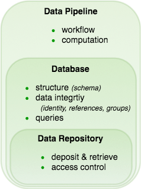
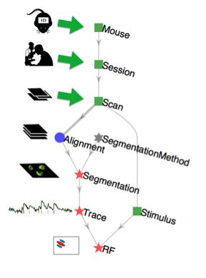
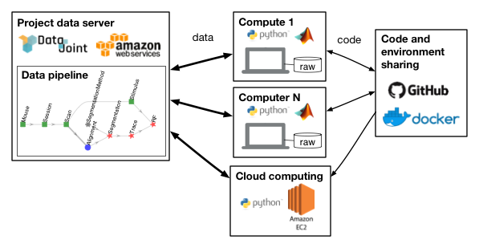

.. progress: 6 100% Dimitri

Data pipelines
==============

What is a data pipeline?
------------------------
A scientific **data pipeline** is a collection of processes and systems for organizing the data, computations, and workflows used by a research group as they jointly perform complex sequences of data acquisition, processing, and analysis.

A variety of tools can be used for supporting shared data pipelines:

Data repositories
  Research teams set up a shared **data repository**.
  This minimal data management tool allows depositing and retrieving data and managing user access.

Database systems
  **Databases** are a form of data repository providing additional capabilities:

    1) Defining, communicating, and enforcing structure in the stored data.
    2) Maintaining data integrity: correct identification of data and consistent cross-references, dependencies, and groupings among the data.
    3) Supporting queries that retrieve various cross-sections and transformation of the deposited data.

Data pipelines
  **Data pipeline** frameworks may include all the features of a database system along with additional functionality:

    1) Integrating computations to perform analyses and manage intermediate results in a principled way.
    2) Supporting distributed computations without conflict.
    3) Defining, communicating, and enforcing **workflow**, making clear the sequence of steps that must be performed for data entry, acquisition, and processing.

  Therefore, a full-featured data pipeline framework may also be described as a `scientific workflow system <https://en.wikipedia.org/wiki/Scientific_workflow_system>`_.

    Major features of data management frameworks: data repositories, databases, and data pipelines.

What is DataJoint?
------------------
DataJoint is a free open-source framework for creating scientific data pipelines directly from MATLAB or Python (or any mixture of the two).
The data are stored in a language-independent way that allows interoperability between MATLAB and Python.
Other programming languages will be added in the future and will be interoperable with the existing data.
DataJoint pipelines become the central tool in the operations of data-intensive labs or consortia as they organize participants with different roles and skills around a common framework.

In DataJoint, a data pipeline is a sequence of steps (more generally, a directed acyclic graph) with integrated data storage at each step.
The pipeline may have some nodes requiring manual data entry or import from external sources.
Experimenters and acquisition instruments feed data into nodes at the head of the pipeline.
Downstream nodes perform automated computations for data processing and analysis.

    For example, this is the pipeline for a simple two-photon imaging experiment using mice as subjects.

In this example, the experimenter first enters information about the mouse information, then imaging session information, and then information for each scan.
Next the automated portion of the pipeline takes over to perform image alignment to compensate for motion, image segmentation to identify cells in the images, and extraction of calcium traces.
Finally, the receptive field (RF) computation is performed by relating the calcium signals to the visual stimulus information.

Data model
----------
DataJoint provides a simplified and powerful data model, which is detailed more formally in `Yatsenko D, Walker EY, Tolias AS. DataJoint: A Simpler Relational Data Model. arXiv preprint arXiv:1807.11104. 2018 Jul 29 <https://arxiv.org/abs/1807.11104>`_.

The data model defines how human data scientists conceptualize the data.
It formalizes the mental constructs and operations on the data.
DataJoint's model is a refinement of the relational data model, in which all data are stored in simple tables and query operations can combine the contents of multiple tables.

When programming, users interact with these nodes in the form MATLAB or Python objects that represent data and computations.
Each object is associated with an individual table in the database.

DataJoint is designed for quick prototyping and continuous exploration.
New experiment designs and analysis methods can be added or removed at any time.
Pipelines can grow large and complex while ever evolving, reflecting the complexity of neuroscience experiments.

DataJoint uses a succinct data definition language, a powerful data query language, and expressive visualizations of the pipeline.
It also features a built-in distributed job management process to allow distributing analysis between any number of computers.

DataJoint works well in combination with good code sharing (e.g. with `git <https://git-scm.com/>`_) and environment sharing (e.g. with `docker <https://www.docker.com/>`_).

A well-defined and principled approach to data organization and computation enables teams of scientists to work together efficiently.

Data architecture
-----------------
The data architecture for a particular project is the configuration of information technologies for managing the data and computations.
DataJoint clearly separates the data model facing the user from the data architecture implementing data management and computing.

  An example of the data architecture for a multi-lab collaboration

Typically, the data architecture includes a relational database server (e.g. MySQL) and a bulk data storage system (e.g. `AWS S3 <https://aws.amazon.com/s3/>`_ or a filesystem).

The data become immediately available to all participants with appropriate access privileges.
Some of the "participants" may be computational agents that perform processing and analysis.

With DataJoint, data sharing and publishing is no longer a separate step at the end of the project.
Instead data sharing is an inherent feature of the process: to share data with other collaborators or to publish the data to the world, one only needs to set the access privileges.

Summary of DataJoint features
-----------------------------

1. A free, open-source framework for scientific data pipelines and workflow management
#. Data hosting in cloud or in-house
#. MySQL, filesystems, S3, and Globus for data management
#. Define, visualize, and query data pipelines from MATLAB or Python
#. Enter and view data through GUIs
#. Concurrent access by multiple users and computational agents
#. Data integrity: identification, dependencies, groupings
#. Automated distributed computation
