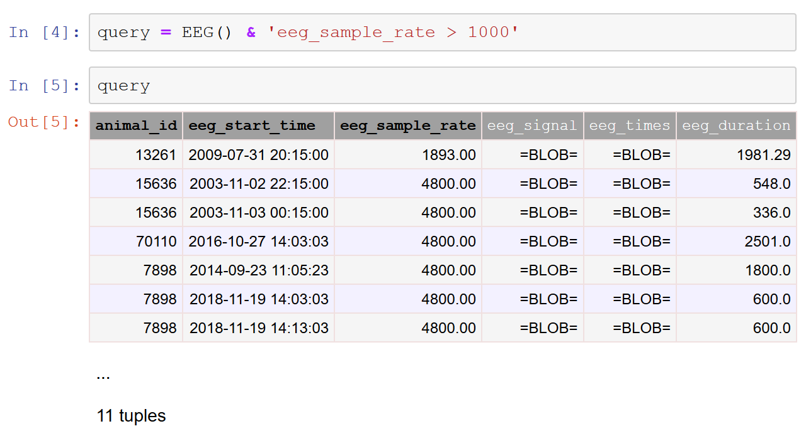

.. progress: 12.0 50% Dimitri

.. _queries:

Query Objects
=============

**Data queries** retrieve data from the database.
A data query is formed from a **query object**, a symbolic representation of the query that does not in itself contain any actual data.
The simplest query object is an instance of a **table class**, representing the contents of an entire table.

For example, if  ``experiment.Session`` is a DataJoint table class, we can create a query object to retrieve its entire contents as follows:

.. matlab 1 start

.. code-block:: matlab

    query = experiment.Session;

.. matlab 1 end

.. python 1 start

.. code-block:: python

    query  = experiment.Session()

.. python 1 end

More generally, a query object may be formed as a **query expression** constructed by applying :ref:`operators <operators>` to other query objects.

For example, the following query retrieves information about all experiments and scans for mouse 102 (excluding experiments with no scans):

.. matlab 2 start

.. code-block:: matlab

    query = experiment.Session * experiment.Scan & 'animal_id = 102';

.. matlab 2 end

.. python 2 start

.. code-block:: python

    query = experiment.Session * experiment.Scan & 'animal_id = 102'

Note that for brevity, query operators can be applied directly to class objects rather than instance objects so that ``experiment.Session`` may be used in place of ``experiment.Session()``.

.. python 2 end

You can preview the contents of the query in Python, Jupyter Notebook, or MATLAB by simply displaying the object.
In the image below, the object ``query`` is first defined as a restriction of the table ``EEG`` by values of the attribute ``eeg_sample_rate`` greater than 1000 Hz.
When we display the object, we get a preview of the entities that will be returned by ``query``.
Note that this preview only lists a few of the entities that will be returned.
Also, the preview does not contain any data for attributes of datatype ``blob``.

   Defining a query object and previewing the entities returned by the query.

Once the desired query object is formed, the query can be executed using its :ref:`fetch <fetch>` methods.
To **fetch** means to transfer the data represented by the query object from the database server into the workspace of the host language.

.. matlab 3 start

.. code-block:: matlab

    s = query.fetch()

Here fetching from the ``query`` object produces the struct array ``s`` of the queried data.

.. matlab 3 end

.. python 3 start

    s = query.fetch()

Here fetching from the ``query`` object produces the NumPy record array ``s`` of the queried data.

.. python 3 end

Checking for returned entities
------------------------------

The preview of the query object shown above displayed only a few of the entities returned by the query but also displayed the total number of entities that would be returned.
It can be useful to know the number of entities returned by a query, or even whether a query will return any entities at all, without having to fetch all the data themselves.

.. python 4 start

The ``bool`` function applied to a query object evaluates to ``True`` if the query returns any entities and to ``False`` if the query does not return any entities.

The ``len`` function applied to a query object determines the number of entities returned by the query.

.. python 4 end

.. matlab 4 start

The ``exists`` function applied to a query object evaluates to ``true`` if the query returns any entities and to ``false`` if the query does not return any entities.

The ``count`` function applied to a query object determines the number of entities returned by the query.

.. matlab 4 end

Normalization in queries
------------------------

Query objects adhere to entity :ref:`normalization <normalization>` just like the stored tables do.
The result of a query is a well-defined entity set with an readily identifiable entity class and designated primary attributes that jointly distinguish any two entities from each other.
The query :ref:`operators <operators>` are designed to keep the result normalized even in complex query expressions.
