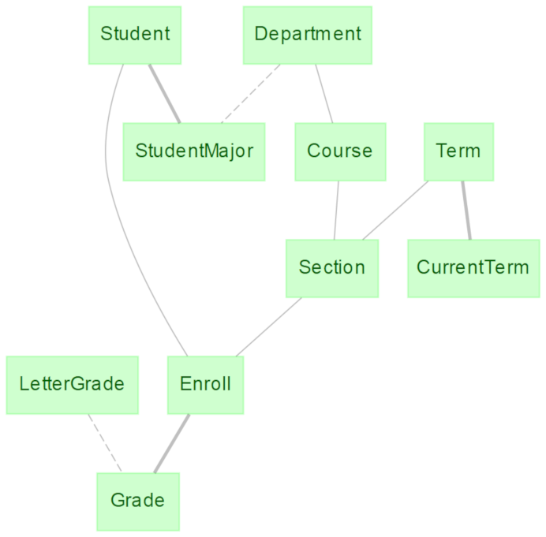

.. progress: 1.0  90% Austin

.. _query-example:

Example Schema
==============

The example schema below contains data for a university enrollment system.
Information about students, departments, courses, etc. are organized in multiple tables.

.. include:: 02-Example-Schema_lang1.rst

Example schema ERD
------------------

    Example schema for a university database. Tables contain data on students, departments, courses, etc.
