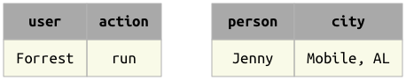
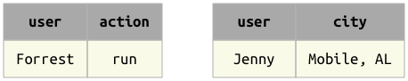

.. progress: 18.0 50% Dimitri

.. _operators:

Operators
=============

:ref:`Data queries <queries>` have the form of expressions using operators to derive the desired table.
The expressions themselves do not contain any data.
They represent the desired data symbolically.

Once a query is formed, the :ref:`fetch <fetch>` methods are used to bring the data into the local workspace.
Since the expressions are only symbolic representations, repeated ``fetch`` calls may yield different results as the state of the database is modified.

DataJoint implements a complete algebra of operators on relations:
O
===================================  =======================================   =================================================================================
operator                             notation                                  meaning
===================================  =======================================   =================================================================================
:ref:`restriction`                   ``A & cond``                              The subset of entities from table ``A`` that meets condition ``cond``
:ref:`restriction`                   ``A - cond``  							  The subset of entities from table ``A`` that does not meet condition ``cond``
:ref:`join`                          ``A * B``     							  Combines all matching information from ``A`` and ``B``
:ref:`proj`                          ``A.proj(...)``  						  Selects and renames attributes from ``A`` or computes new attributes
:ref:`aggr`                          ``A.aggr(B, ...)``  					  Same as projection but allows computations based on matching information in ``B``
:ref:`union`                         ``A + B``     							  All unique entities from both ``A`` and ``B``
===================================  =======================================   =================================================================================

Principles of relational algebra
---------------------------------
DataJoint's relational algebra improves upon the classical relational algebra and upon other query languages to simplify and enhance the construction and interpretation of precise and efficient data queries.

The clarity of DataJoint's query expressions stems from the concept of :ref:`entity integrity <integrity>`.
Entity integrity states that every table must have a well-defined **primary key**.
In other systems, this concept applies to **base tables**, which store the data in the database.
DataJoint extends entity integrity to queries as well (see :ref:`queries`).

1. **Purely relational**: Data are represented and manipulated in the form of tables representing entity sets.
1. **Algebraic closure**: All operators operate on tables and yield tables.
   Thus query expressions may be used as operands in other expressions or may be assigned to variables to be used in other expressions.
1. **Attributes are identified by names**:  All attributes of relations have well-defined names.
   This includes queries resulting from operators.
	 Operators use attribute names to determine how to perform the operation.
	 The order of the attributes in tables is not significant.
1. **All relations have a primary key**:  This includes queries resulting from operators, for which the primary key is properly derived from the primary keys of the operands in expressions.
   Operators use the information about the operands' primary keys to define the query.

Matching entities
-----------------

Binary operators in DataJoint are based on the concept of **matching entities**, and we will use this phrase throughout.

	| Two entities **match** when they have no common attributes or when their common attributes contain the same values.

Here **common attributes** are those that have the same names in both entities.
It is usually assumed that the common attributes are of compatible datatypes to allow equality comparisons.

Another way to phrase the same definition is

	| Two entities match when they have no common attributes whose values differ.

It may be conceptually convenient to imagine that all tables always have an additional invisible attribute, ``omega`` whose domain comprises only one value, 1.
Then the definition of matching entities is simplified:

| Two entities match when their common attributes contain the same values.

Matching entities can be **merged** into a single entity without any conflicts of attribute names and values.

Examples
^^^^^^^^
This is a matching pair of entities:

.. image:: ../_static/img/matched_tuples1.png

and so is this one:

but these entities do *not* match:

Join compatibility
-------------------
All binary operators with other tables as their two operands require that the operands be **join-compatible**, which means that:

1. All common attributes in both operands (attributes with the same name) must be part of the primary key or of a foreign key.
2. All common attributes in the two relations must be of a compatible datatype for equality comparisons.

These restrictions are introduced both for performance reasons and for conceptual reasons.
For performance, they encourage queries that rely on indexes.
For conceptual reasons, they encourage database design in which entities in different tables are related to each other by the use of primary keys and foreign keys.
