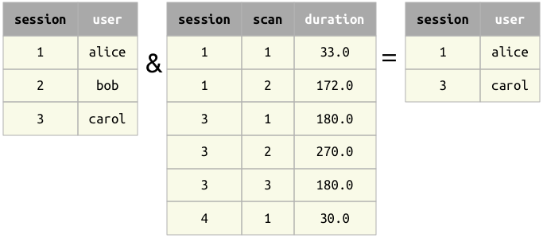
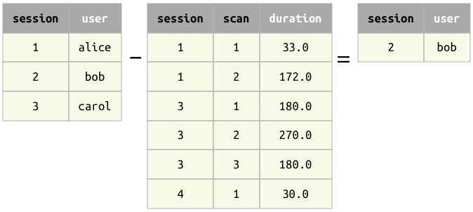
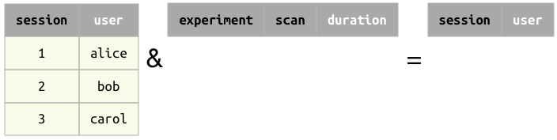

.. progress: 14.0 50% Austin

.. _restriction:

Restriction
===========

Restriction operators ``&`` and ``-``
-------------------------------------

The restriction operator ``A & cond`` selects the subset of entities from ``A`` that meet the condition ``cond``.
The exclusion operator ``A - cond`` selects the complement of restriction, i.e. the subset of entities from  ``A`` that do not meet the condition ``cond``.

.. figure:: ../_static/img/op-restrict.png
    :align: center
    :alt: Restriction and exclusion

    Restriction and exclusion

The condition ``cond`` may be one of the following:

.. matlab 1 start

* another table
* a mapping, or ``struct``
* an expression in a character string
* a collection of conditions as a ``struct`` or cell array
* a Boolean expression (``true`` or ``false``)

.. matlab 1 end

.. python 1 start

* another table
* a mapping, e.g. ``dict``
* an expression in a character string
* a collection of conditions, e.g. a ``list``
* a Boolean expression (``True`` or ``False``)
* an ``AndList``
* a ``Not`` object

.. python 1 end

As the restriction and exclusion operators are complementary, queries can be constructed using both operators that will return the same results.
For example, the queries ``A & cond`` and ``A - Not(cond)`` will return the same entities.

Restriction with a table
------------------------

When restricting table ``A`` with another table ``A & B``, the two relations must be **join-compatible**.
The result will contain all entities from ``A`` for which there exist a matching entity in ``B``.

Restriction with another table
^^^^^^^^^^^^^^^^^^^^^^^^^^^^^^

   Restriction with another table

Difference |Difference from another table|

Restriction with a table with no common attributes
^^^^^^^^^^^^^^^^^^^^^^^^^^^^^^^^^^^^^^^^^^^^^^^^^^

.. figure:: ../_static/img/restrict-example2.png
   :alt: Restriction with a table with no common attributes

   Restriction with a table with no common attributes

Difference |Difference from another table with no common attributes|

Restriction with an empty table
^^^^^^^^^^^^^^^^^^^^^^^^^^^^^^^

|Restriction with an empty table| Difference |Difference from an empty table|

Restriction by a mapping
------------------------

A key-value mapping may be used as an operand in restriction.
For each key that is an attribute in ``A``, the paired value is treated as part of an equality condition.
Any key-value pairs without corresponding attributes in ``A`` are ignored.

Restriction by a string
-----------------------

Restriction can be performed when ``cond`` is an explicit condition on attribute values, expressed as a string.
Such conditions may include arithmetic operations, functions, range tests, etc.

Restriction by a collection
---------------------------

When ``cond`` is a collection of conditions, the conditions are applied by logical disjunction (logical OR).
Thus, restriction of table ``A`` by a collection will return all entities in ``A`` that meet *any* of the conditions in the collection.

Restriction by a Boolean expression
-----------------------------------

Restriction by an ``AndList``
-----------------------------

The special function ``And`` represents logical conjunction (logical AND).
Restriction of table ``A`` by an ``AndList`` will return all entities in ``A`` that meet *all* of the conditions in the list.

Restriction by a ``Not`` object
-------------------------------

The special function ``Not`` represents logical negation, such that ``A & Not(cond)`` is equivalent to ``A \ cond``.

.. |Difference from another table with no common attributes| image:: ../_static/img/diff-example2.png

.. |Difference from an empty table| image:: ../_static/img/diff-example3.png
