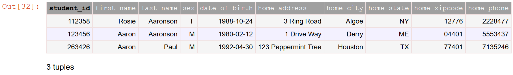
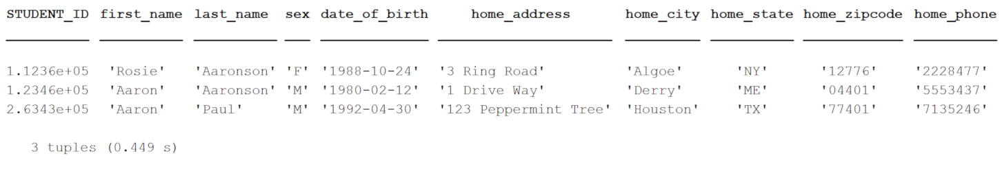

.. progress: 14.0 50% Austin

.. _restriction:

Restriction
===========

Restriction operators ``&`` and ``-``
-------------------------------------

The restriction operator ``A & cond`` selects the subset of entities from ``A`` that meet the condition ``cond``.
The exclusion operator ``A - cond`` selects the complement of restriction, i.e. the subset of entities from  ``A`` that do not meet the condition ``cond``.

.. figure:: ../_static/img/op-restrict.png
    :align: center
    :alt: Restriction and exclusion

    Restriction and exclusion.

The condition ``cond`` may be one of the following:

.. matlab 1 start

* another table
* a query expression
* a mapping, or ``struct``
* an expression in a character string
* a collection of conditions as a ``struct`` or cell array
* a Boolean expression (``true`` or ``false``)

.. matlab 1 end

.. python 1 start

* another table
* a query expression
* a mapping, e.g. ``dict``
* an expression in a character string
* a collection of conditions as a ``list`` or ``tuple``
* a Boolean expression (``True`` or ``False``)
* an ``AndList``
* a ``Not`` object

.. python 1 end

As the restriction and exclusion operators are complementary, queries can be constructed using both operators that will return the same results.
For example, the queries ``A & cond`` and ``A - Not(cond)`` will return the same entities.

Restriction by a table
----------------------

When restricting table ``A`` with another table, written ``A & B``, the two tables must be **join-compatible** (see :ref:`join-compatible`).
The result will contain all entities from ``A`` for which there exist a matching entity in ``B``.
Exclusion of table ``A`` with table ``B``, or ``A - B``, will contain all entities from ``A`` for which there are no matching entities in ``B``.

.. figure:: ../_static/img/restrict-example1.png
    :alt: Restriction by another table

    Restriction by another table.

.. figure:: ../_static/img/diff-example1.png
    :alt: Exclusion by another table

    Exclusion by another table.

Restriction by a table with no common attributes
^^^^^^^^^^^^^^^^^^^^^^^^^^^^^^^^^^^^^^^^^^^^^^^^

Restriction of table ``A`` with another table ``B`` having none of the same attributes as ``A`` will simply return all entities in ``A``, unless ``B`` is empty as described below.
Exclusion of table ``A`` with ``B`` having no common attributes will return no entities, unless ``B`` is empty as described below.

.. figure:: ../_static/img/restrict-example2.png
   :alt: Restriction by a table with no common attributes

   Restriction by a table having no common attributes.

.. figure:: ../_static/img/diff-example2.png
   :alt: Exclusion by a table having no common attributes

   Exclusion by a table having no common attributes.

Restriction by an empty table
^^^^^^^^^^^^^^^^^^^^^^^^^^^^^

Restriction of table ``A`` with an empty table will return no entities regardless of whether there are any matching attributes.
Exclusion of table ``A`` with an empty table will return all entities in ``A``.

.. figure:: ../_static/img/restrict-example3.png
   :alt: Restriction by an empty table

   Restriction by an empty table.

.. figure:: ../_static/img/diff-example3.png
   :alt: Exclusion by an empty table

   Exclusion by an empty table.

Restriction by a query
----------------------

Restriction by a query or query object is no different from restriction by a table, because queries in DataJoint adhere to :ref:`entity normalization <normalization>` and produce well-defined entity sets.
As such, restriction by queries follows the same behavior as restriction by tables described above.

Restriction by a mapping
------------------------

A key-value mapping may be used as an operand in restriction.
For each key that is an attribute in ``A``, the paired value is treated as part of an equality condition.
Any key-value pairs without corresponding attributes in ``A`` are ignored.

Restriction by an empty mapping or by a mapping with no keys matching the attributes in ``A`` will return all the entities in ``A``.
Exclusion by an empty mapping or by a mapping with no matches will return no entities.

For example, let's say that table ``Session`` has the attribute ``session_date`` of :ref:`datatype <datatypes>` ``datetime``.
We are interested in sessions from January 1st, 2018, so we write the following restriction query using a mapping.

.. python 2 start

.. code-block:: python

    Session & {'session_dat': "2018-01-01"}

.. python 2 end

.. matlab 2 start

.. code-block:: matlab

    Session & struct('session_dat', '2018-01-01')

.. matlab 2 end

Our mapping contains a typo omitting the final ``e`` from ``session_date``, so no keys in our mapping will match any attribute in ``Session``.
As such, our query will return all of the entities of ``Session``.

Restriction by a string
-----------------------

Restriction can be performed when ``cond`` is an explicit condition on attribute values, expressed as a string.
Such conditions may include arithmetic operations, functions, range tests, etc.
Restriction of table ``A`` by a string containing an attribute not found in table ``A`` produces an error.

Restriction by a collection
---------------------------

.. python 3 start

A collection in Python can be a list or tuple.

.. code-block:: python

    # a list:
    cond_list = ['first_name = "Aaron"', 'last_name = "Aaronson"']

    # a tuple:
    cond_tuple = ('first_name = "Aaron"', 'last_name = "Aaronson"')

.. python 3 end

.. matlab 3 start

.. warning::
  This section documents future intended behavior in MATLAB, which is contrary to current behavior.
  DataJoint for MATLAB has an open `issue <https://github.com/datajoint/datajoint-matlab/issues/128>`_ tracking this change.

A collection in MATLAB can be a cell array or structure array.
Cell arrays can contain collections of arbitrary restriction conditions.
Structure arrays are limited to collections of mappings, each having the same attributes.

.. code-block:: matlab

    % a cell aray:
    cond_cell = {'first_name = "Aaron"', 'last_name = "Aaronson"'}

    % a structure array:
    cond_struct = struct('first_name', 'Aaron', 'last_name', 'Paul')
    cond_struct(2) = struct('first_name', 'Rosie', 'last_name', 'Aaronson')

.. matlab 3 end

When ``cond`` is a collection of conditions, the conditions are applied by logical disjunction (logical OR).
Thus, restriction of table ``A`` by a collection will return all entities in ``A`` that meet *any* of the conditions in the collection.
For example, if we restrict the ``Student`` table by a collection containing two conditions, one for a first and one for a last name, our query will return any students with a matching first name *or* a matching last name.

.. python 4 start

.. code-block:: python

    Student() & ['first_name = "Aaron"', 'last_name = "Aaronson"']

    Restriction by a collection, returning any entities matching any condition in the collection.

.. python 4 end

.. matlab 4 start

.. code-block:: matlab

    university.Student() & {'first_name = "Aaron"', 'last_name = "Aaronson"'}

    Restriction by a collection, returning any entities matching any condition in the collection.

.. matlab 4 end

Restriction by an empty collection returns no entities.
Exclusion of table ``A`` by an empty collection returns all the entities of ``A``.

Restriction by a Boolean expression
-----------------------------------

.. python 5 start

``A & True`` and ``A - False`` are equivalent to ``A``.
``A & False`` and ``A - True`` are empty.

.. python 5 end

.. matlab 5 start

``A & true`` and ``A - false`` are equivalent to ``A``.
``A & false`` and ``A - true`` are empty.

.. matlab 5 end

.. python 6 start

Restriction by an ``AndList``
-----------------------------

The special function ``dj.AndList`` represents logical conjunction (logical AND).
Restriction of table ``A`` by an ``AndList`` will return all entities in ``A`` that meet *all* of the conditions in the list.
``A & dj.AndList([c1, c2, c3])`` is equivalent to ``A & c1 & c2 & c3``.
Usually, it is more convenient to simply write out all of the conditions, as ``A & c1 & c2 & c3``.
However, when a list of conditions has already been generated, the list can simply be passed as the argument to ``dj.AndList``.

Restriction of table ``A`` by an empty ``AndList``, as in ``A & dj.AndList([])``, will return all of the entities in ``A``.
Exclusion by an empty ``AndList`` will return no entities.

Restriction by a ``Not`` object
-------------------------------

The special function ``dj.Not`` represents logical negation, such that ``A & dj.Not(cond)`` is equivalent to ``A - cond``.

.. python 6 end
