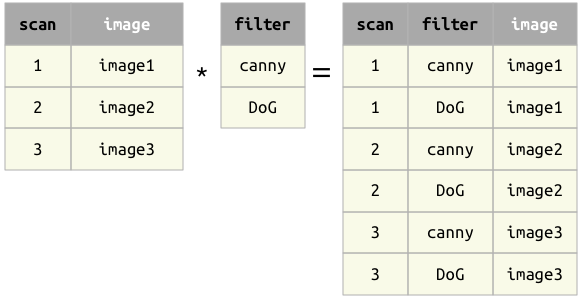
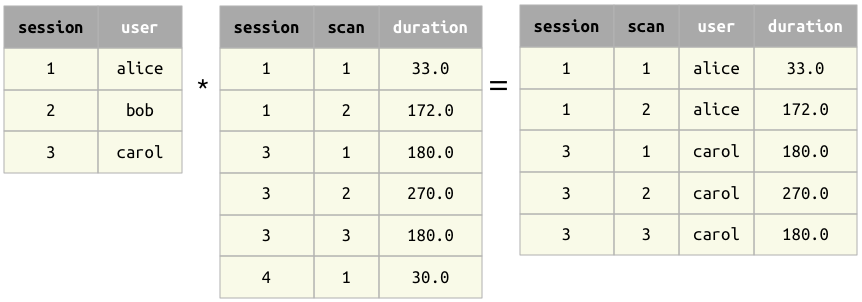
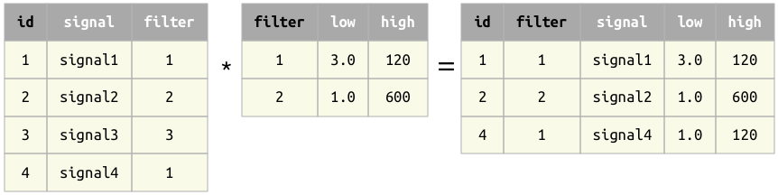
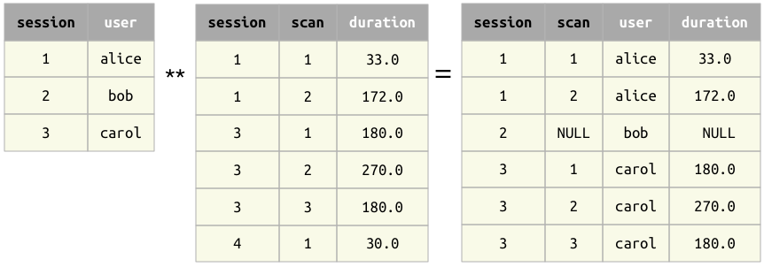

.. progress: 8.0 50% Austin

.. _join:

Join
====

Join operator ``*``
-------------------

The Join operator ``A * B`` combines the matching information in ``A`` and ``B``.
The result contains all matching combinations of entities from both arguments.

Principles of joins
~~~~~~~~~~~~~~~~~~~

1. The operands ``A`` and ``B`` must be **join-compatible**.
2. The primary key of the result is the union of the primary keys of the operands.

Examples of joins
~~~~~~~~~~~~~~~~~

Example 1 : When the operands have no common attributes, the result is the cross product -- all combinations of entities.

Example 2 : When the operands have common attributes, only entities with matching values are kept.

Example 3 : Joining on secondary attribute

Left join
~~~~~~~~~

*Left joins are not yet implemented:*
https://github.com/datajoint/datajoint-python/issues/264

A modification of the join operator is the **left join**.
It is implemented as ``A ** B`` in Python and ``A .* B`` in MATLAB.
The left join keeps all the entities from ``A`` even in the absence of the matching entities from ``B``.
For entities with no matches in ``B``, the secondary attributes from ``B`` are filled with ``NULL``\ s.

Example 4 : A left join

*Caution:* The left join is the only operator that can introduce ``NULL``\ s in the primary key of the result.
``NULL``\ s in primary attributes may produce unintuitive results in subsequent expressions.

Properties of join
~~~~~~~~~~~~~~~~~~

1. When ``A`` and ``B`` have the same attributes, the join ``A * B`` becomes equivalent to the set intersection ``A`` ∩ ``B``.
   Hence, DataJoint does not need a separate intersection operator.

2. Commutative: ``A * B`` is equivalent to ``B * A``.
   However, the left join is *not* commutative.

3. Associative: ``(A * B) * C`` is equivalent to ``A * (B * C)``.
   However, the left joint is *not* associative.
