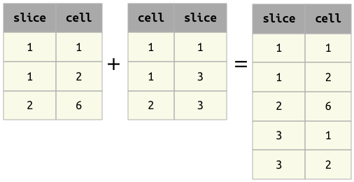
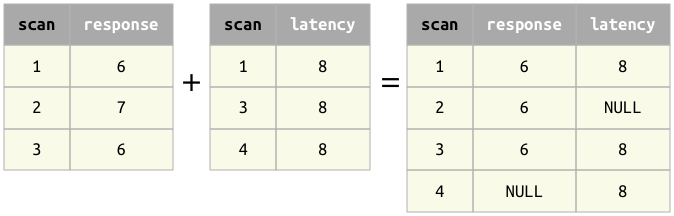

Union
=====

Union operator ``+``
--------------------

    The union operator is not yet implemented -- this page serves as the
    specification for the upcoming implementation. Union is rarely
    needed in practice.

The result of the union operator ``A + B`` contains all the tuples from
both operands.

Principles of union
~~~~~~~~~~~~~~~~~~~

1. As in all operators, the order of the attributes in the operands is
   not significant.
2. Operands ``A`` and ``B`` must have the same primary key attributes.
   Otherwise, an error will be raised.
3. Operands ``A`` and ``B`` may not have any common non-key attributes.
   Otherwise, an error will be raised.
4. The result ``A + B`` will have the same primary key as ``A`` and
   ``B``.
5. The result ``A + B`` will have all the non-key attributes from both
   ``A`` and ``B``.
6. For tuples that are found in both ``a`` and ``b`` (based on the
   primary key), the non-key attributes will be filled from the
   corresponding tuples in ``A`` and ``B``.
7. For tuples that are only found in either ``A`` or ``B``, the other
   operands' non-key attributes will filled with NULLs.

Examples of union
~~~~~~~~~~~~~~~~~

Example 1 : Note that the order of the attributes does not matter.

Example 2 : Non-key attributes are combined from both relations and
filled with NULLs when missing.

Properties of union
~~~~~~~~~~~~~~~~~~~

1. Commutative: ``A + B`` is equivalent to ``B + A``.
2. Associative: ``(A + B) + C`` is equivalent to ``A + (B + C)``.

