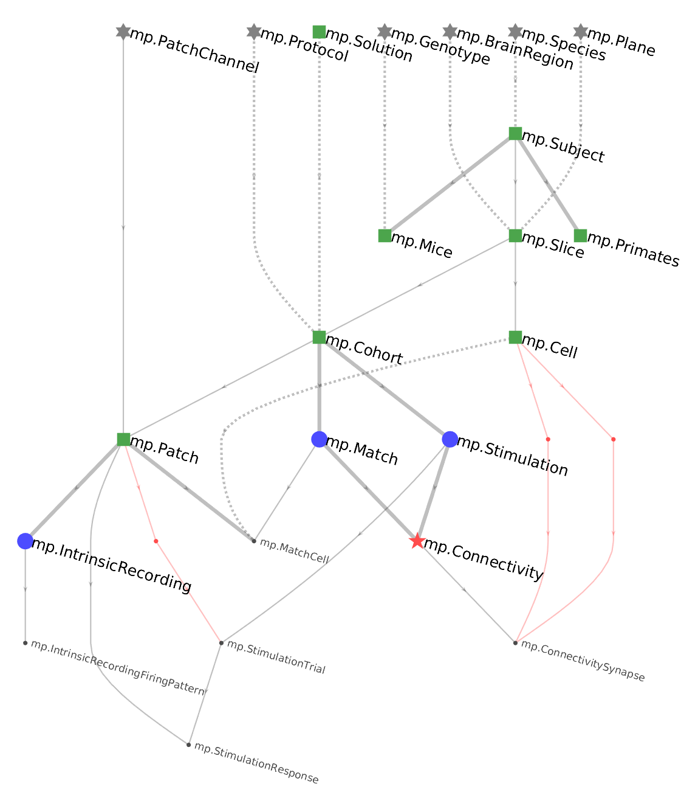

# ERD

ERD stands for *entity relationship diagram*.  Objects of type `dj.ERD` allow visualizing portions of the data pipeline in graphical form.  Tables are depicted as nodes and foreign keys as directed edges between them.  
The `draw` method plots the graph.

## Diagram notation
Consider the following ERD


DataJoint uses the following conventions: 
* Tables are indicated as nodes in the graph.  The corresponding class name is indicated by each node.
* [DataTiers][Data-tiers] are indicated as colors and symbols: Lookup=gray asterisk, Manual=green square, Imported=blue circle,  Computed=red star, Part=black dot.  The names of [[part tables]] are indicated in a smaller font.
* [[Foreign keys]] are indicated as edges in the graph and always directed downward, forming a *directed acyclic graph*.
* Foreign keys contained within the primary key are indicated as solid lines.  This means that the referenced table becomes part of the primary key of the dependent table.
* Foreign keys that are outside the primary key are indicated by dashed lines. 
* If the primary key of the dependent table has no other attributes besides the foreign key, the foreign key is a thick solid line, indicating a 1:{0,1} relationship. 
* Foreign keys made without renaming the foreign key attributes are in black whereas foreign keys that rename the attributes are indicated in red.  This includes renamed foreign keys within the primary key (solid line) or outside (dashed line).

.. _Part: ../computation/Part-tables

## Diagramming an entire schema

### Python
To plot the ERD for an entire schema in Python, an ERD object can be initialized with the schema object (which is normally used to decorate table objects) 
```python
import datajoint as dj
schema = dj.schema('my_database', locals())
dj.ERD(schema).draw()
```
or, alternatively an object that has the schema object as an attribute, such as the module defining a schema:
```python
import datajoint as dj
import seq    # import the sequence module defining the seq database
dj.ERD(seq).draw()   # draw the ERD
```

### MATLAB
In MATLAB, the schema object for a package can be obtained using its `getSchema` function (See [[Create a schema]])

```matlab
% matlab
draw(dj.ERD(seq.getSchema))   % draw the ERD
```

MATLAB provides shortcuts to plot ERD of a table neighborhood or a schema using the `erd` command:
```matlab
erd stimulus   % plot the ERD of the stimulus schema
erd stimulus.Trial  % plot the neighborhood of the stimulus.Trial table
erd stimulus experiment preprocess.Sync  % plot the stimulus and experiment schemas and the neighborhood of preprocess.Sync
```

### Initializing with a single table
A `dj.ERD` object can be initialized with a single table.

```matlab
% matlab
draw(dj.ERD(seq.Genome))
```

```python
# python
dj.ERD(seq.Genome()).draw()
```

A single node makes a rather boring graph but ERDs can be added together or subtracted from each other using graph algebra.

### Adding ERDs together
However two graphs can be added, resulting in new graph containing the union of the sets of nodes from the two original graphs. The corresponding foreign keys will be automatically 

```matlab
% matlab: plot the ERD with tables Genome and Species from package +seq.
draw(dj.ERD(seq.Genome) + dj.ERD(seq.Species))
```
```python
# python: plot the ERD with tables Genome and Species from module seq.
(dj.ERD(seq.Genome()) + dj.ERD(seq.Species())).draw()
```

### Expanding ERDs upstream and downstream 
Adding a number to an ERD object adds nodes downstream in the pipeline while subtracting a number from ERD object adds nodes upstream in the pipeline.

Examples:

Plot all the tables directly referencing `seq.Genome`:
```matlab
% matlab
draw(dj.ERD(seq.Genome)+1)
```
```python
# python
(dj.ERD(seq.Genome)+1).draw()
```

Plot all the tables directly referenced by `seq.Genome`:
```matlab
% matlab 
draw(dj.ERD(seq.Genome)-1)
```
```python
# python
(dj.ERD(seq.Genome)-1).draw()
```

Plot the local neighborhood of `seq.Genome`
```matlab
% matlab
draw(dj.ERD(seq.Genome)+1-1+1-1)
```
```python
# python
(dj.ERD(seq.Genome)+1-1+1-1).draw()
```
