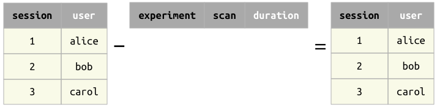

# Restriction

## Restriction operators `&` and `-`
The restriction operator `A & cond` selects the subset of relation `A` that meet the condition `cond`. 
Its negated counterpart `A - cond` selects the subset of relation `A` that does not meet the condition `cond`.

The condition `cond` may be one of the following:
* another relation,
* a mapping (e.g. `dict` in Python or `struct` in MATLAB).
* an expression in a character string.
* a collection of conditions (e.g. a `list` in Python or a cell array in MATLAB)
* an `AndList`
* A boolean expression (`True` or `False` in Python or `true` or `false` in MATLAB)

### Restriction with a relation 
When restricting relation `A` with another relation `A & B`, the two relations must be *join-compatible*.  The result will contain all tuples from `A` for which there exist a matching tuple in `B`. 

#### Restriction with another relation

Difference

#### Restriction with a relation with no common attributes

Difference

#### Restriction with an empty relation

Difference
