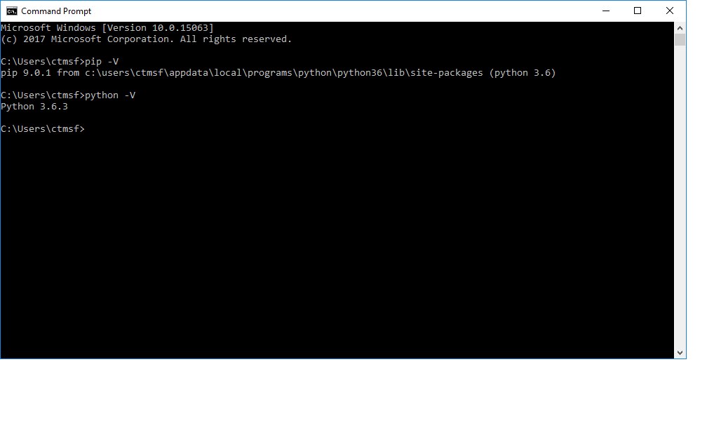
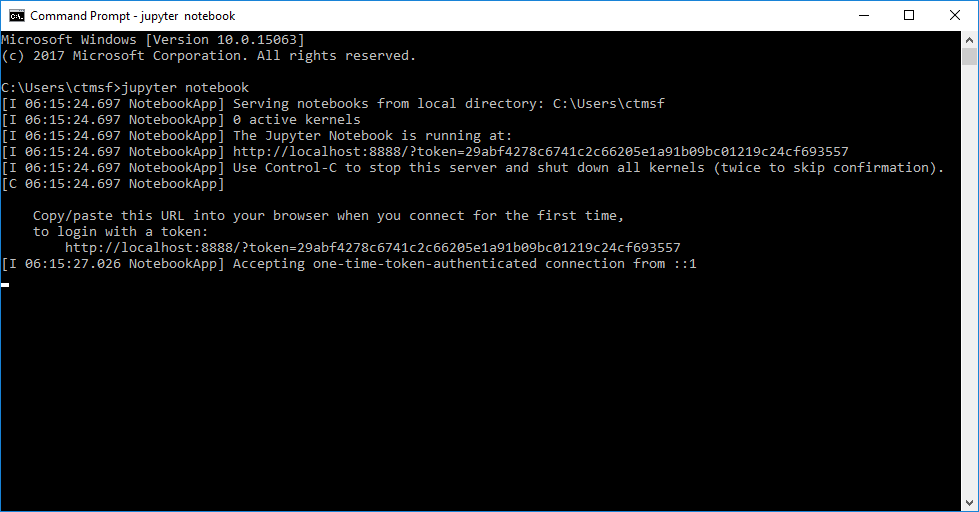

DataJoint Python Windows Install Guide
======================================

This document outlines the steps necessary to install DataJoint on
windows for use in connecting to a remote server hosting a DataJoint
database. Some limited discussion of installing MySQL is discussed
in `MySQL for Windows`_, but is not covered in-depth since this is
an uncommon usage scenario and not strictly required to connect to
DataJoint pipelines.

Quick Steps
~~~~~~~~~~~

Quick install steps for advanced users are as follows:

- install latest python 3.x and ensure it is in PATH
  (3.6.3 current at time of writing)
- pip install datajoint

For ERD drawing support:

- Install graphviz for windows and ensure it is in PATH
  (64 bit builds currently tested; URL below.)
- pip install pydotplus matplotlib

Detailed instructions follow.

Step 1: Install Python
~~~~~~~~~~~~~~~~~~~~~~

Python for Windows is available from:

https://www.python.org/downloads/windows

The latest 64 bit 3.x version, currently 3.6.3, `is available 
from the python site <https://www.python.org/ftp/python/3.6.3/python-3.6.3-amd64.exe>`_ .

From here, run the installer to install python.

For a single-user machine, the regular installation process is sufficient -
be sure to select the `Add Python to PATH` option:

For a shared machine, run the installer as administrator (right-click,
run as administrator) and select the advanced installation. Be sure to
select options as follows:

Step 2: Verify Installation
~~~~~~~~~~~~~~~~~~~~~~~~~~~

To verify the python installation and make sure that your system
is ready to install datajoint, open a command window by entering 'cmd'
into the windows search bar:

.. image:: ../_static/img/windows/cmd-prompt.png

From here, python and the python package manager, `pip` can be
verified by running `python -V` and `pip -V`, respectively:

If you relieve the error message that either `pip` or `python` is not
a recognized command, please uninstall python and ensure that the
option to add python to the PATH variable was properly configured.

Step 3: Install DataJoint
~~~~~~~~~~~~~~~~~~~~~~~~~

DataJoint (and other python modules) can be easily installed using
the `pip` python package manager which is installed as a part of python
and was verified in the previous step.

To install datajoint simply run `pip install datajoint`:

.. image:: ../_static/img/windows/install-datajoint-1.png

This will proceed to install DataJoint, along with several other
required packages from the PIP repository. When finished, a summary of
the activity should be presented:

You can find out more about the packages installed and many freely
available other open source packages via `pypi <https://pypi.python.org/pypi>`_, the python package index site.

(Optional) Step 4: Install Packages for ERD Support
~~~~~~~~~~~~~~~~~~~~~~~~~~~~~~~~~~~~~~~~~~~~~~~~~~~

To draw ERD diagrams of your DataJoint schema, the following additional
steps should be followed.

Install Graphviz
~~~~~~~~~~~~~~~~

DataJoint currently utilizes `graphviz <http://graphviz.org>`_ to
generate the ERD diagrams for DataJoint. Although a windows version
of graphviz is available from the main site, it is an older and out
of date 32-bit version, and so we recommend using the pre-release
builds of the 64 bit version, which are available here:

https://ci.appveyor.com/project/ellson/graphviz-pl238

More specifically, we use the build artifacts from the 'Win64; Configuration: Release' which are available `here <https://ci.appveyor.com/api/buildjobs/hlkclpfhf6gnakjq/artifacts/build%2FGraphviz-install.exe>`_ .

This is a regular windows installer executable, and will present a dialog
when starting:

.. image:: ../_static/img/windows/install-graphviz-1.png

It is important that an option to place graphviz in the PATH be selected.

For a personal installation:

To install system wide:

.. image:: ../_static/img/windows/install-graphviz-2b.png

Once installed, graphviz can be verified from a fresh command window
as follows:

.. image:: ../_static/img/windows/verify-graphviz-install.png

If you receive the error message that the `dot` program is not a
recognized command, please uninstall `graphviz` and ensure that the
option to add python to the PATH variable was properly configured.

Also please note: in the case of the system-wide install, running
the 'dot -c' command was required to properly initialize the graphviz
installation.

Install Pydotplus
~~~~~~~~~~~~~~~~~

The pydotplus library links the graphviz installation to DataJoint,
and is easily installed via `pip`:  

.. image:: ../_static/img/windows/install-pydotplus.png

Install Matplotlib
~~~~~~~~~~~~~~~~~~

The matplotlib library provides useful plotting utilities which are
also used by DataJoint's ERD drawing facility, and is and is easily
installed via `pip`:

.. image:: ../_static/img/windows/install-matplotlib.png

(Optional) Step 5: Install Jupyter Notebook
-------------------------------------------

As described on `the jupyter.org website <http://jupyter.org>`_:

'The Jupyter Notebook is an open-source web application that allows
you to create and share documents that contain live code, equations,
visualizations and narrative text.'

Although not a part of datajoint, jupyter notebook can be a very
useful tool for building and interacting with datajoint pipelines,
and is easily installed from `pip` as well:

.. image:: ../_static/img/windows/install-jupyter-1.png
.. image:: ../_static/img/windows/install-jupyter-2.png

Once installed, jupyter notebook can be started via the `jupyter notebook`
command, which should now be on your path:

.. image:: ../_static/img/windows/verify-jupyter-install.png

By default, jupyter notebook will start a local private webserver
session from the directory where it was started and start a web
browser session connected to the session.

.. image:: ../_static/img/windows/run-jupyter-2.png

From here, you now should be able to use the notebook viewer to navigate
the filesystem and use it to create new project folders and interactive 
jupyter/python/datajoint notebooks.

Git For Windows
~~~~~~~~~~~~~~~

The `Git <https://git-scm.com/>`_ version control system is not a
part of datajoint per-se but can be useful to install for interacting
with the broader python/git/github sharing ecosystem.  

The git for windows installer is available from 
`https://git-scm.com/download/win <https://git-scm.com/download/win>`_

.. image:: ../_static/img/windows/install-git-1.png

The default settings should be sufficient/correct in most cases.

MySQL for Windows
~~~~~~~~~~~~~~~~~

To host pipelines locally, the MySQL server package is required. 

MySQL for windows can be installed via the installers `available
<https://dev.mysql.com/downloads/windows/>`_ from the MySQL website
. Please note that although DataJoint should be fully compatible
with a windows MySQL server installation, this mode of operation
is not tested by the DataJoint team.

